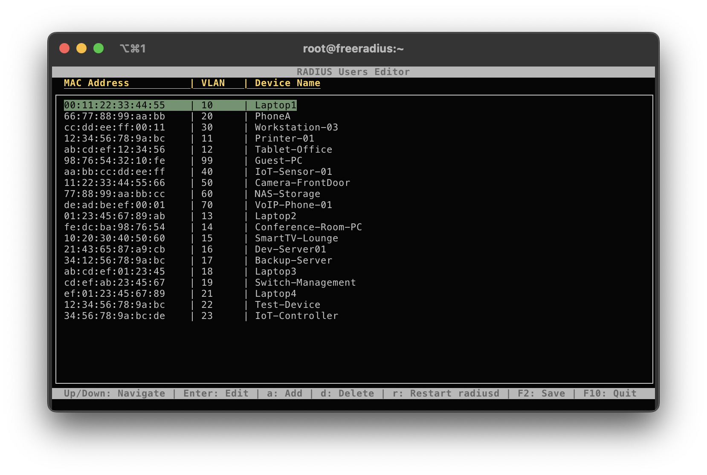

# radtui
A TUI for editing a simple freeradius users configuration file for dynamic VLAN assignment via MAB.



# Usage:
Add `## BEGIN CURSES ##` and `## END CURSES ##` before and after device definitions in `/etc/raddb/users`. 

Example:

```
## BEGIN CURSES ##
# Laptop1
00:11:22:33:44:55       Cleartext-Password := "00:11:22:33:44:55"
                        Tunnel-Type = VLAN,
                        Tunnel-Medium-Type = 6,
                        Tunnel-Private-Group-Id = 10
# PhoneA
66:77:88:99:aa:bb       Cleartext-Password := "66:77:88:99:aa:bb"
                        Tunnel-Type = VLAN,
                        Tunnel-Medium-Type = 6,
                        Tunnel-Private-Group-Id = 20
## END CURSES ##

##
## Other unrelated config below
##
```